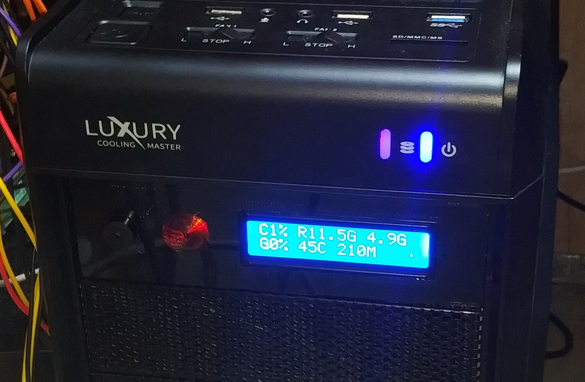

# LCD525 Panel

> [English version](README.md)

Монитор состояния ПК на базе Arduino (клона WAVGAT UNO, LGT8F) и LCD-дисплея
1602 (16×2, I2C). Кроссплатформенное приложение (Windows и Linux, Python,
собрано Nuitka) опрашивает систему, выводит данные на дисплей, управляет
пищалкой и светодиодом, а также сигнализирует о подключении/отключении
USB-устройств и о появлении окон с ошибками.

## Возможности

- **Индикация на LCD 16×2:**
  - загрузка CPU, частота CPU;
  - занятая RAM;
  - загрузка GPU (nvidia-smi), температура, частота;
  - температура CPU (Windows: LibreHardwareMonitor / OpenHardwareMonitor;
    Linux: hwmon sysfs или lm-sensors);
  - IP адрес в локальной сети, число запущенных процессов,
    скорость TX/RX по сети.
- **Несколько страниц дисплея** — экран циклически переключает несколько
  настраиваемых страниц с задержкой переключения (на страницу или общей).
- **Сеточная раскладка** — каждое поле это ячейка с настраиваемой подписью,
  колонкой и строкой (0–15, 0–1), поэтому LCD можно выстроить как таблицу.
- **Живое превью LCD** — пиксельное превью 16×2 внизу каждой вкладки
  настроек, обновляется при редактировании.
- **Анимация запуска** — заголовок «LCD525 PANEL» набирается по буквам,
  прогресс-бар, затем переход в рабочий режим.
- **Спиннер** — bitmap-анимация колеса (8 пользовательских символов CGRAM)
  в правом нижнем углу, обновление каждые 350 мс.
- **Звуковая сигнализация:**
  - ошибки/предупреждения по заголовкам окон (Windows: Win32 API;
    Linux: X11 через python-xlib или xdotool);
  - подключение/отключение USB-устройств (Windows: SetupAPI;
    Linux: /sys/bus/usb);
  - установка/потеря связи с ПК;
  - `None`/`off` — без звука;
  - 20 мелодий: `short`, `long`, `double`, `triple`, `rapid`, `chime_up`,
    `chime_down`, `siren`, `wake`, `buzz`, `notification`, `success`, `sad`,
    `alarm`, `rising`, `falling`, `doorbell`, `sos`, `fanfare`, `game_over`;
  - список игнорирования заголовков окон (без тревоги/звука);
  - подключение/отключение SATA-дисков (Windows: WMI `Win32_DiskDrive`,
    Linux: `/sys/block`, несъёмные `sd*`/`hd*`).
- **Светодиод** (пин 13): PWM-«нагрузка» по загрузке CPU и мигание при тревоге.
- **Автозапуск**, иконка в трее, настройки через GUI (Windows: реестр;
  Linux: XDG autostart `.desktop`).

## Аппаратная часть

| Компонент | Пин/адрес |
|---|---|
| Arduino (клона UNO, LGT8F) | — |
| LCD 1602 I2C | адрес `0x27`, SDA = A4, SCL = A5 |
| Пищалка (buzzer) | пин **3** (по умолчанию, настраивается) |
| Светодиод | пин **13** (встроенный) |
| COM-порт | 9600 бод, строка заканчивается `\n` |

## Протокол

Пищалка может быть активной (`active`) или пассивной (`passive`). Для пассивной
звук генерируется в прерывании TIMER1 (soft-PWM 32 кГц), частота и громкость
настраиваются. Настройки сохраняются в EEPROM платы.

Команды от ПК к плате:

| Команда | Назначение |
|---|---|
| `D:line1\|line2` | обновить текст на дисплее (16 и 15 символов) |
| `A:pattern` | мелодия + мигание светодиода 2 с |
| `B:pattern` | только мелодия |
| `X:0-100` | скважность светодиода (PWM, цикл 500 мс) |
| `P:2-13` | пин пищалки (сохраняется в EEPROM) |
| `V:0-100` | громкость |
| `F:100-10000` | частота пассивной пищалки, Гц |
| `S:25-400` | скорость мелодии, % |
| `T:passive\|active` | тип пищалки |
| `L:on\|off` | вкл/выкл светодиода |
| `Q:` | ответ `S:pin,passive,volume,freq,speed,beeping` |

## Установка и запуск

### Приложение для Windows

Готовый `LCD525Panel.exe` собирается `build.py` и устанавливается в
`%LOCALAPPDATA%\LCD525Panel\`:

```
python build.py
```

Требования для сборки: Python 3.11+, Nuitka, компилятор C (MSVC).

### Приложение для Linux

`build.py` сам определяет платформу: бинарник собирается и ставится в
`~/.local/bin/LCD525Panel` (автозапуск и пункт меню создаются в
`~/.config/autostart/` и `~/.local/share/applications/`):

```
python3 build.py
```

Зависимости (Debian/Ubuntu):

```
sudo apt install python3 python3-tk python3-pil python3-serial python3-psutil
pip3 install pystray python-xlib
```

Для сигнализации по заголовкам окон нужен X11 (через `python-xlib`;
запасной вариант — `xdotool`). Под чистым Wayland трей и мониторинг окон
ограничены; приложение всё равно работает «headless»: опрос системы,
LCD и сигнализация по USB работают.

### Прошивка

На Windows сборка и заливка прошивки Arduino — `flash.bat` / `flash.ps1`:

```
flash.bat -Board uno            # Arduino Uno, автопорт
flash.bat -Board lgt8f -Port COM13
flash.bat -Board mega -Programmer usbasp
```

На Linux — `flash.sh`:

```
./flash.sh -Board uno           # Arduino Uno, автопорт
./flash.sh -Board lgt8f -Port /dev/ttyUSB0
./flash.sh -Board uno -BuildOnly   # только собрать
```

Тулчейны на Linux: системные пакеты (`gcc-avr`, `avrdude`) или тулчейн
Arduino IDE в `~/.arduino15/packages/`. Ядра: стандартное Arduino
(`~/.arduino15/packages/arduino/hardware/avr/` или
`/usr/share/arduino/hardware/arduino/avr`) и WAVGAT LGT8F
(`~/.arduino15/packages/wavgat/hardware/avr/`). Библиотека
`LiquidCrystal_I2C` ожидается в `~/Arduino/libraries/`.

### Зависимости

`psutil`, `pystray`, `PIL` (Pillow), `pyserial`; на Linux также `python-xlib`.

### Настройки

Windows: `%APPDATA%\LCD525Panel\config.json` (логи — `app.log`).
Linux: `~/.config/LCD525Panel/config.json` (или `$XDG_CONFIG_HOME`).


## Настройки

Окно настроек открывается из меню иконки в трее.

- **Connection** — COM-порт, интервал обновления.
- **Notifications** — слежение за окнами ошибок/предупреждений, пищалка
  (пин, тип, громкость, частота, скорость), паттерны для ошибок/предупреждений,
  тестовые кнопки, список игнорирования заголовков окон.
- **Display** — редактор страниц: добавить/удалить страницу, имя страницы и
  задержку переключения, добавлять/удалять поля (подпись, ключ данных,
  колонка, строка) для сеточной раскладки; превью 16×2 видно на всех вкладках.
- **USB** — звук при подключении/отключении USB-устройств.
- **Disks** — звук при подключении/отключении SATA-дисков.
- **Delays** — интервалы опроса: GPU, температура CPU, монитор окон,
  монитор USB, монитор SATA-дисков, повтор реконнекта, минимальная пауза
  между тревогами.

Дополнительно в меню трея: статус, реконнект, автозапуск, папка с настройками.

## Структура проекта

```
AVR/AVR.ino      прошивка Arduino
main.py          кроссплатформенное приложение (опрос системы, LCD, звук)
build.py         сборка (Nuitka onefile; .exe для Windows / бинарник для Linux)
flash.ps1        сборка и заливка прошивки в Windows
flash.bat        обёртка для flash.ps1
flash.sh         сборка и заливка прошивки в Linux
3D_models/       STL-модели корпуса
```
